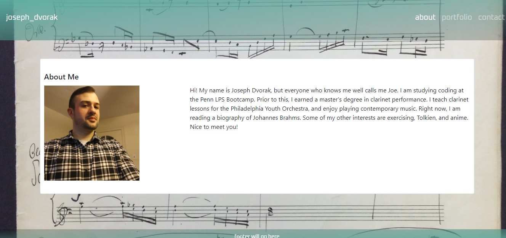

# Read Me

This repo contains source code for my personal portfolio website. The deployed application can be accessed [here.](https://dvorakjt.github.io/penn-bootcamp-hw-2/) The focus of this project was using Boostrap components as well as the Bootstrap grid to organize the page

## The About Page - Bootstrap Components

The about page links to the Portfolio and Contact pages via the links to the top right. This accomplished via the boostrap navbar component:

   <nav  class="navbar navbar-expand-lg navbar-dark">
		
The items to the right collapse into a toggler as the page grows smaller. 

This is accomplished via a button with these Bootstrap classes applied:

	<button  class="navbar-toggler"  type="button"  data-toggle="collapse"  data-target="#navbarNav"

	aria-controls="navbarNav"  aria-expanded="false"  aria-label="Toggle navigation">

	

	</button>

Finally, a card is used to present the About Me section in a clear, visually-appealing way.

    

		

			

				 
				<h5  class="card-title">About Me</h5>
				

					

						
					

					

				
About me text here...

 The card should expand and contract depending on the viewport size. The text wraps around the image as necessary. 
 This is accomplished via this code:
 

    

	    

			
		

		

The col-lg-(column width) class means that the column will be collapsed unless within a large window, ensuring correct text-wrapping.

