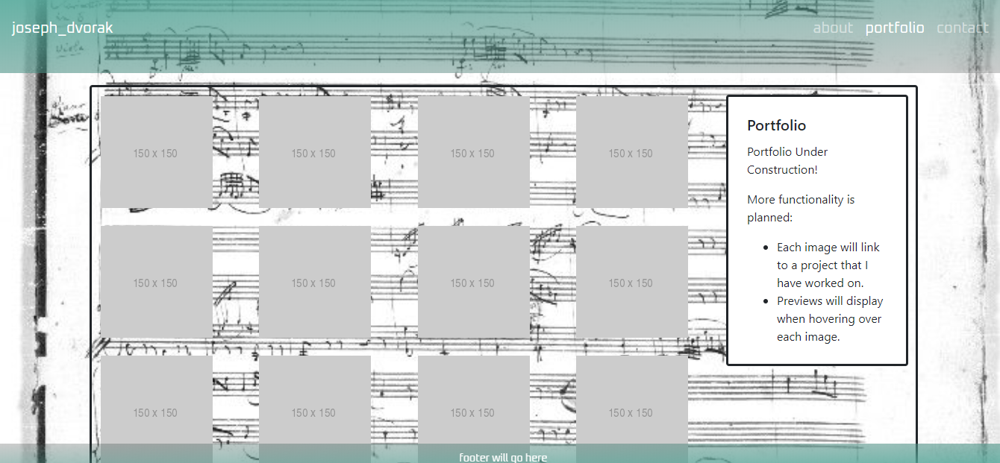

# Read Me

This repo contains source code for my personal portfolio website. The deployed application can be accessed [here.](https://dvorakjt.github.io/penn-bootcamp-hw-2/) The focus of this project was using Bootstrap components as well as the Bootstrap grid to organize the page

## The About Page - Bootstrap Components

The about page links to the Portfolio and Contact pages via the links to the top right. This accomplished via the boostrap navbar component:

	<nav  class="navbar navbar-expand-lg navbar-dark">
		
The items to the right collapse into a toggler as the page grows smaller. 

This is accomplished via a button with these Bootstrap classes applied:

	<button  class="navbar-toggler"  type="button"  data-toggle="collapse"  data-
	target="#navbarNav"aria-controls="navbarNav"  aria-expanded="false"  aria-
	label="Toggle navigation">
		
	</button>

Finally, a card is used to present the About Me section in a clear, visually-appealing way.

    

		

			

				 
				<h5  class="card-title">About Me</h5>
				

					

						
					

					

				
About me text here...

 The card should expand and contract depending on the viewport size. The text wraps around the image as necessary. 
 This is accomplished via this code:
 

    

	    

			
		

		

The col-lg-(column width) class means that the column will be collapsed unless within a large window, ensuring correct text-wrapping.

## Portfolio Page - Bootstrap Components

The navbar component is once again used at the top of the page.
The focal point of the page is a card, with placeholder images representing screenshots of soon-to-be-completed projects/repos. There is another card within this card describing the page. All of these elements resize appropriately based on the viewport.

To accomplish this, many rows and columns were necessary. As in the index page, a

    

wraps the entirety of the page after the navbar. Within this, there is a row housing one column, which in turn houses the outer card. Within this, there is another row, split into one larger column (9/12ths wide), and one smaller column (3/12ths wide). The smaller column houses the description card. The larger column, is broken up into 3 sub-rows that house the placeholder images. The code is very long, so please refer to lines 34 to 100 in the portfolio.html file to see it in its full state.

## Contact Page - Bootstrap Components

For the contact page, a Bootstrap navbar class is again used. 
The focal point of this page is a card housing forms, completed with a button. 
The outer card is given an id for CSS purposes (see below). Most of this code is basically pre-written by Boostrap. I customized it slightly by omitting certain card elements and replacing them with form components, and adjusting the rows so that the input areas for "Name" and "Message" were sized appropriately.

	

		

			<h5  class="card-title">Contact</h5>
			<h6  class="card-subtitle mb-2 text-muted">Name</h6>
			

				<textarea  class="form-control"  id="nameInputArea"  rows="1">		
				</textarea>
			

			<h6  class="card-subtitle mb-2 text-muted">Email</h6>
			

				<input  type="email"  class="form-control"  id="emailInputArea"  
				placeholder="name@example.com">
			

			<h6  class="card-subtitle mb-2 text-muted">Message</h6>
			

				<textarea  class="form-control"  id="messageInputArea"  rows="6">
				</textarea>
			

			<button  class="btn btn-info"  type="submit">Send message</button>
		

	

## styles.css
In addition to the components provided by Bootstrap, I decided to add a styles.css sheet.
First, this allows me to use a Google font by linking to google fonts in the html sheets, and then using that font for the nav.

linking to the Google Fonts style sheet:

    <link  href="https://fonts.googleapis.com/css?family=Oxanium&display=swap"  		
    rel="stylesheet">
applying the font using the nav { } selector:

    nav { font-family: "Oxanium", sans-serif; }
  Next, the style sheet allowed me to apply background images to all of the pages. The navbar floats about the background image, which is important for an additional style you will see below.
  This is accomplished by enclosing everything after the `<body>` tag within a `
`. Different pages are also assigned different id's so that the specific image can vary even though the general specifications stay the same: `
.` The general specs for these background images were adapted from the hero image in HW1.

The navbar is formatted in css so that there is a transparent gradient look to it. The footer is entirely crafted using css, and has an inverse of this gradient applied.

Finally, css is used to make the outer portfolio card transparent.

## About the Background Images
The background image for the "About Me" page is the first page of the autograph score of Carl Nielsen's clarinet concerto, a work that I have played many times, which is very important to me.

The background image for the portfolio page is a page from the autograph score of a Mozart trio which includes clarinet. During the classical period, a common compositional device was sonata form, which features a "development" section. Since we are learning web development, I felt that this was a neat connection to make.

Finally, the contact page features a page from the score to "Kontakte," an electronic piece by Stockhausen. Kontakte is german for contacts. 

